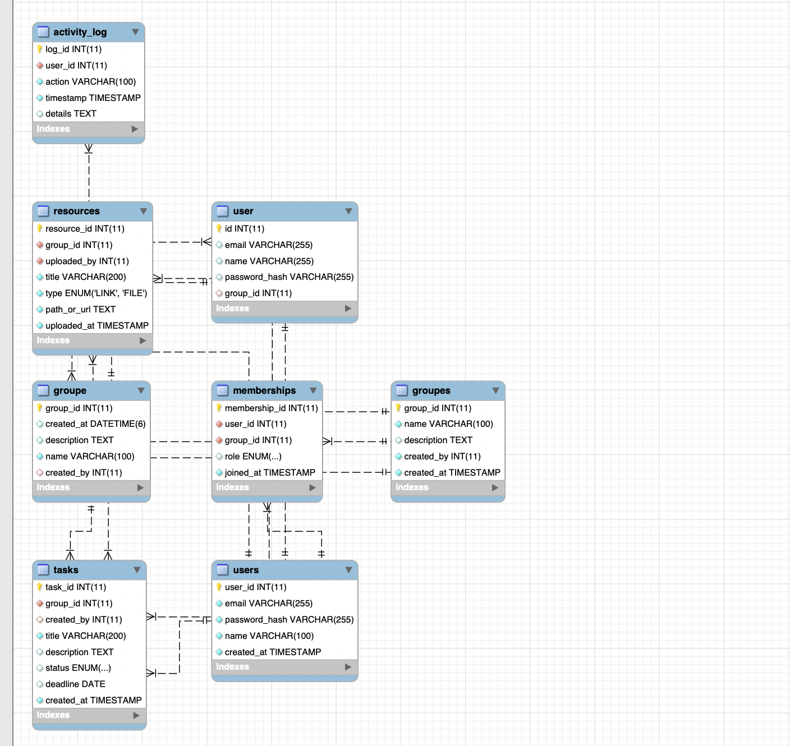
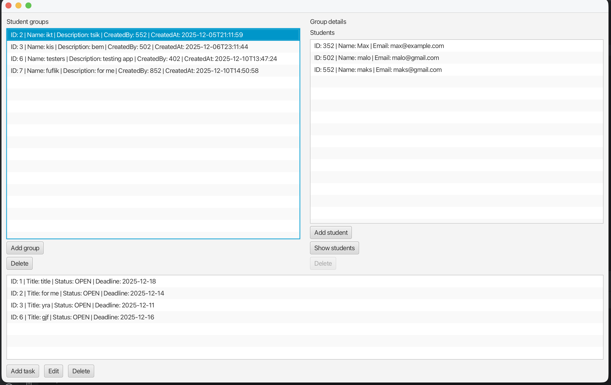

#Stručný popis projektu a cieľov aplikácie

Aplikácia umožňuje vytvárať skupiny, pridávať študentov a úlohy, je vytvorená skôr pre študentov ako zlepšenie a štruktúrovanie úloh

#Architektúra systému (diagram + vysvetlenie vrstiev)

~~[Open](architekturaSystemu.txt)

#Dokumentácia REST API a WebSocket endpointov

#Ukážky používateľského Rozhrania

#Popis výziev a riešení

Problém: Problémy s získavaním údajov zo servera, ako sú rôzne typy údajov a parsovanie JSON.
Riešenie: Vracať a prijímať rovnaké typy údajov.

#Zhodnotenie práce s AI – čo pomohlo, čo muselo byť manuálne doladené

AI veľmi pomáhalo odhaľovať chyby, ako napríklad nesprávne zadané parametre alebo nesprávne použitie entity, a pomohlo riešiť náročnejšie úlohy, ako napríklad odstránenie študenta z triedy cez listener.
Jeden z príkladov pre výber študentov:

~~
